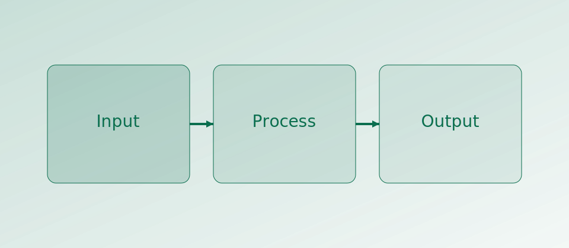
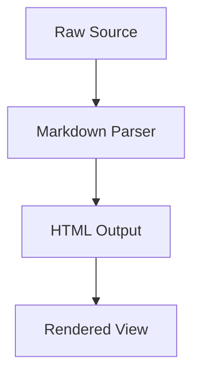

[[toc]]

## Internal Links

This sentence links to another post: [[post--partitioning-primer|Partitioning primer]].

This sentence links to a snippet: [[snippet--pandas-groupby|Pandas groupby snippet]].

## Admonitions

> [!NOTE] Note Callout
> This is a note admonition rendered from blockquote syntax.

> [?TIP] Tip Callout
> Keep headings consistent to get a clean auto-generated table of contents.

> [!WARNING] Warning Callout
> Unknown internal wiki links are validated and will fail `validate`.

## Footnotes

Inline footnote reference example[^fn-demo].

Another reference reusing the same footnote[^fn-demo].

[^fn-demo]: Footnotes are rendered at the bottom with back-links.

## Figure

{width=65%}

Text continues below the figure block to demonstrate normal flow.

## Mermaid Diagram



## Python Highlighting

```python
from collections import Counter

events = ["ingest", "ingest", "validate", "build", "build", "build"]
counts = Counter(events)

for name, n in counts.items():
    print(f"{name}: {n}")
```

## Maths Rendering

Inline math: $e^{i\pi} + 1 = 0$.

Block math:

$$
\nabla \cdot \vec{F} = \frac{\partial F_x}{\partial x} + \frac{\partial F_y}{\partial y} + \frac{\partial F_z}{\partial z}
$$
