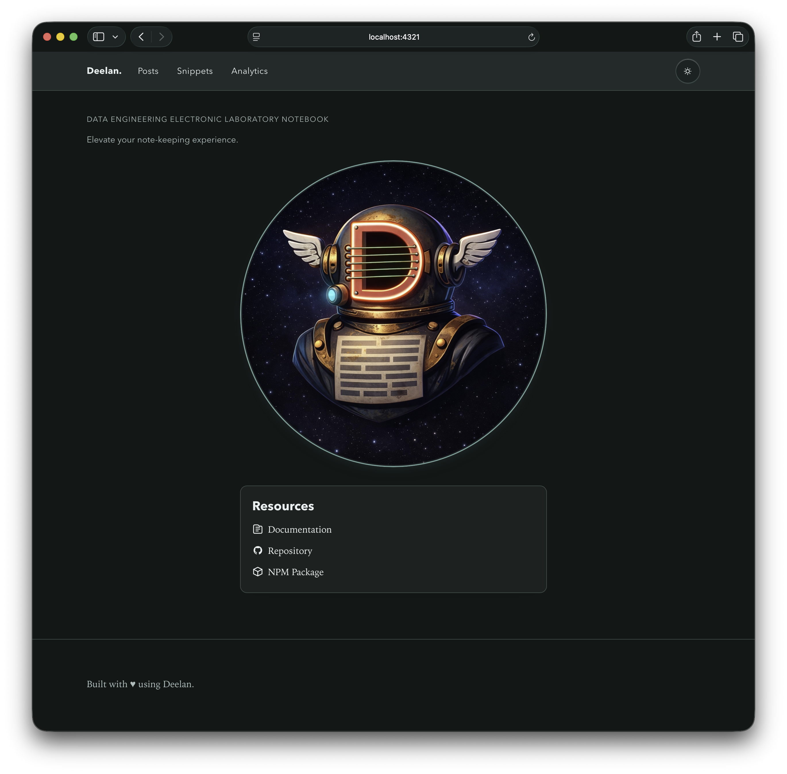
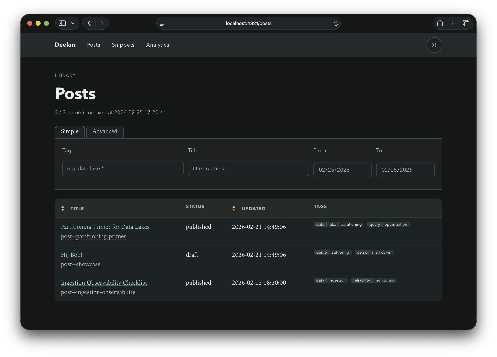

# Visual Gallery

## Theming

```yml title="deelan.config.yml"
default_theme: light
```


```yml title="deelan.config.yml"
default_theme: dark
```




```yml title="deelan.config.yml"
default_theme: dark
accent_hue: 10
```


---

## Posts and Snippets

View and search posts at `/posts`:



View and filter snippets at `/snippets`:


Posts and snippets can be exported as standalone artifacts using e.g.:
```bash
deelan export --id post--showcase --format html --out ./exports
```

[View standalone showcase HTML.](assets/showcase/index.html)

---

## Analytics

Each post or snippet can be assigned multiple tags. 
The analytics page at `/analytics` displays basic tag statistics. All tags can also be explored in a table: 


The relationships between posts and snippets, as defined by internal links between them (see `related_ids` frontmatter property), can be visualized as a graph with network-theoretic metrics computed at build time:


