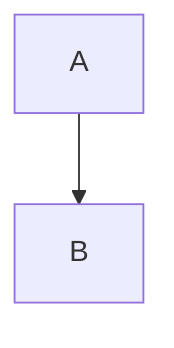

# Authoring Features

DEELAN supports extended markdown authoring for posts/snippets.

## Internal Links

Use wiki-style links:

- `[[post--de-partitioning-primer]]`
- `[[snippet--pandas-groupby-snippet|Pandas groupby snippet]]`

These render to `/view/<id>` links.
`npm run validate` fails on unknown internal IDs.

## Table of Contents

Use either marker in markdown:

- `[[toc]]`
- `[toc]`

If omitted, DEELAN auto-injects a TOC when headings are present.

## Admonitions (Callouts)

Use blockquote callout syntax:

```md
> [!NOTE] Optional title
> Body text.
```

Supported common types include `NOTE`, `TIP`, `WARNING`, `DANGER`, `CAUTION`.

## Footnotes

```md
Text with a reference[^1].

[^1]: Footnote body.
```

## Figures

Use markdown image syntax with a width specifier:

```md
{width=60%}
{width=120mm}
```

Supported units:

- `%`
- `mm`
- `cm`
- `in`

Figures render as centered block elements with caption below.
When using relative paths, DEELAN mirrors content assets to `public/content-assets/...` during build/dev,
using `/content-assets/<entity-type>/<slug-or-subpath>/...`.

## Asset Management Best Practices

Recommended conventions as content grows:

1. Keep assets close to content.

    - post assets: `content/posts/assets/<post-slug>/...`
    - snippet assets: `content/snippets/assets/<snippet-slug>/...`

2. Use relative paths from the markdown file.

    - `{width=65%}`

3. Use deterministic file names.

    - `figure-01-overview.svg`
    - `table-01-benchmarks.png`
    - avoid spaces and uppercase

4. Prefer source formats when possible.

    - diagrams: `svg` preferred
    - photos/screenshots: `png`/`jpg`
    - keep very large binaries out of git history when avoidable (`git lfs` recommended)

5. Keep one asset folder per document when it has many figures.

    - easier refactors
    - easier cleanup when deleting content

6. For shared assets, use an explicit shared directory.

    - `content/posts/assets/shared/...` or `content/snippets/assets/shared/...`
    - only for assets intentionally reused across many items of the same entity type

7. Validate before publishing.

    - run `npm run validate`
    - run `npm run build` and inspect `/view/<id>`

## Mermaid Diagrams

Use fenced code blocks:

````md

````

Mermaid blocks are currently displayed as source blocks (no in-app diagram renderer).
If you need rendered diagrams today, generate an image (for example SVG/PNG) and include it as a figure.
